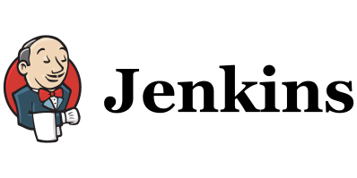
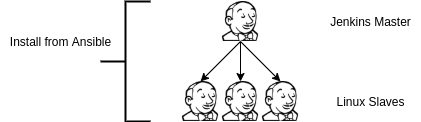

Język: [EN](README.md), [PL](README.PL.md)

Omówienie Jenkinsa
=========
https://www.jenkins.io/

Jenkins to darmowy serwer automatyzacji typu open source. Pomaga zautomatyzować części tworzenia oprogramowania związane z budowaniem, testowaniem i wdrażaniem, ułatwiając ciągłą integrację i ciągłe dostarczanie.

### Jenkins Master
Na wirtualnej maszynie jenkins master tworzony jest użytkownik techniczny, a na nim uruchamiany kontener jenkins. Jenkins master zleca zadania do wykonania do jenkins slave'ów.

### Jenkins Slave
Na wirtualnej maszynie tworzony jest użytkownik techniczny nie zbędny do komunikacji po SSH z jenkins masterem oraz zainstalowane są narzędzia używane podczas wykonywania jobów

### Komunikacja z usługami
Obecnie mój jenkins (https://hub.docker.com/repository/docker/wolfsea89/jenkins_master) komunikuje się:
- jednostronie z repozytoriami git
- jest w stanie pobrać i wysłać obraz dockerowy do repozytorium (testowane na dockerhub i github)

### Joby
- [SeedJob](jobs/seedJobs.PL.md)
- [Budowanie kontenera](jobs/buildContainer.PL.md)

Instalacja Jenkinsa
=========

Lista repozytoriów:
=========
- [Ansible-Jenkins](https://github.com/wolfsea89/Ansible-Jenkins.git)
- [Jenkins-BaseImage](https://github.com/wolfsea89/Jenkins-BaseImage.git)
- [Jenkins-SeedJobs](https://github.com/wolfsea89/Jenkins-SeedJobs.git)
- [Jenkins-Ci-Jenkinsfiles](https://github.com/wolfsea89/Jenkins-Ci-Jenkinsfiles.git)
- [Jenkins-Sharedlibraries](https://github.com/wolfsea89/Jenkins-Sharedlibraries.git)

[Powrót](../../../README.md)