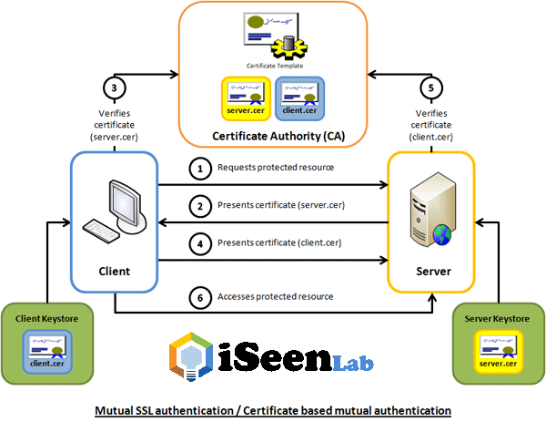

Certyfikaty SSL
=========




(Zródło: https://www.iseenlab.com/how-does-ssl-certificate-work-actual-process/)


Certyfikat CA
=========

Plik konfiguracyjny z parametrami wejściowymi do generowania certyfikatu CA

```
mrachuna@nbo-rachuna-002:~/cert $ cat ca.rachuna.net.cnf 
[ req ]
prompt = no
distinguished_name = req_distinguished_name

[ req_distinguished_name ]
C = PL
ST = Kujawsko-Pomorskie
L = Torun
O = rachuna.net
OU = SysAdmin/DevOps
CN = rachuna.net
emailAddress = xyz@rachuna.net
```

Generowanie certyfikatu CA
```
openssl req -nodes -newkey rsa:4096 -keyout CA-rachuna.net.key -new -x509 -days 365 -out CA-rachuna.net.crt -config CA-rachuna.net.cnf 
```

- `CA-rachuna.net.crt` to publiczny plik certyfikatu urzędu certyfikacji. Użytkownicy, serwery i klienci będą używać tego certyfikatu, aby sprawdzić, czy należą do tej samej sieci zaufania. Każdy użytkownik i serwer korzystający z lokalnego urzędu certyfikacji będzie musiał mieć kopię tego pliku. Wszystkie strony będą polegać na publicznym certyfikacie, aby upewnić się, że ktoś nie podszywa się pod system i nie przeprowadza ataku typu Man-in-the-middle.

- `CA-rachuna.net.key` to klucz prywatny, którego CA używa do podpisywania certyfikatów dla serwerów i klientów. Jeśli osoba atakująca uzyska dostęp do Twojego urzędu certyfikacji do tego pliku, będziesz musiał zniszczyć swój urząd certyfikacji. Z tego powodu plik `CA-rachuna.net.key` powinien znajdować się tylko na komputerze urzędu certyfikacji i najlepiej, aby komputer urzędu certyfikacji pozostawał w trybie offline, gdy nie podpisuje żądań certyfikatów, jako dodatkowy środek bezpieczeństwa.


Certyfikat Serwera
=========

Plik konfiguracyjny z parametrami wejściowymi do generowania certyfikatu dla usługi / serwera

```
mrachuna@nbo-rachuna-002:~/cert $ cat router.rachuna.net.cnf 
subjectAltName = @alt_names

[ req ]
prompt = no
distinguished_name = req_distinguished_name

[ req_distinguished_name ]
C = PL
ST = Kujawsko-Pomorskie
L = Torun
O = rachuna.net
OU = SysAdmin/DevOps
CN = rachuna.net
emailAddress = rachuna.maciej@gmail.com

[alt_names]
DNS.0 = router.rachuna.net
```

Generowanie certyfikatu SSL
```
openssl req -newkey rsa:4096 -nodes -keyout router.rachuna.net.key -out router.rachuna.net.csr -config router.rachuna.net.cnf
```
Podpisywanie wygenerowanego certyfikatu certyfikatem CA
```
openssl x509 -req -days 365 -in router.rachuna.net.csr -CA CA-rachuna.net.crt -CAkey CA-rachuna.net.key -set_serial 01 -out router.rachuna.net.crt -extfile router.rachuna.net.cnf
```

Certyfikat Serwera w wersji jks
=========
Przykład wykonany dla jenkinsa:

```
#### Tworzenie mapy
echo "subjectAltName = @alt_names

[ req ]
prompt = no
distinguished_name = req_distinguished_name

[ req_distinguished_name ]
C = PL
ST = Kujawsko-Pomorskie
L = Torun
O = rachuna.net
OU = SysAdmin/DevOps
CN = rachuna.net
emailAddress = rachuna.maciej@gmail.com

[alt_names]
DNS.0 = jenkins.rachuna.net
" > jenkins.rachuna.net.cnf 

#### Generowanie certyfikatu
openssl req -newkey rsa:4096 -nodes -keyout jenkins.rachuna.net.key -out jenkins.rachuna.net.csr -config jenkins.rachuna.net.cnf

#### Podpisywanie certyfikatu certyfikatem CA
openssl x509 -req -days 365 -in jenkins.rachuna.net.csr -CA CA-rachuna.net.crt -CAkey CA-rachuna.net.key -set_serial 01 -out jenkins.rachuna.net.crt -extfile jenkins.rachuna.net.cnf

#### Generowanie certyfikatu p12
openssl pkcs12 -export -in jenkins.rachuna.net.crt -inkey jenkins.rachuna.net.key -out jenkins.rachuna.net.p12 -name jenkins.rachuna.net
Enter Export Password: << p12_password >>
Verifying - Enter Export Password: << p12_password >>

#### Generowanie klucza jks
keytool \
  -importkeystore \
  -deststorepass << jks_password >> \
  -destkeypass << jks_password >> \
  -destkeystore jenkins.rachuna.net.jks \
  -srckeystore jenkins.rachuna.net.p12 \
  -srcstoretype PKCS12 \
  -srcstorepass << p12_password >> \
  -alias jenkins.rachuna.net
```

[Powrót](../../README.md)