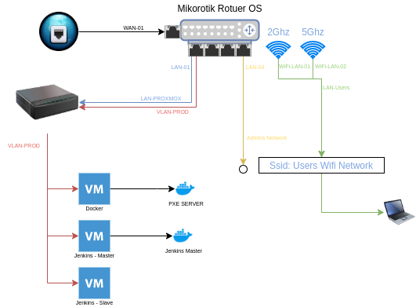

Ogólny schemat sieci
=========



Mikrotik Interface
=========
| Interface | Name        | Network     |
| --------- | ------------| ----------- |
| ether1    | WAN-01      |             |
| ether2    | LAN-01      | LAN-PROXMOX |
| ether3    | LAN-02      | LAN-PROXMOX |
| ether4    | LAN-03      | LAN-PROXMOX |
| ether5    | LAN-04      | LAN-ADMINS  |
| wlan1     | WiFi-LAN-01 | LAN-USERS   |
| wlan2     | WiFi-LAN-02 | LAN-USERS   |
| vlan10    | VLAN-PROD   | LAN-PROD    |


Ustawienie na serwerze DNS
=========

Za pomocą Ansible, można ustawić adres fqdn na routerze mikrotik w serwerze DNS, jeśli chcesz ręcznie ustaw taką politykę.
Przykład fqdn: `mv-vm-021.rachuna.net`
```
/ip dns static add name=<< fqdn >> address=<< addess_ip >> type=A comment=<< fqdn >>"
/ip dns static add regexp=\".*\\\\.<< fqdn >>\" address=<< addess_ip >> type=A"
```

[Powrót](../../README.md)