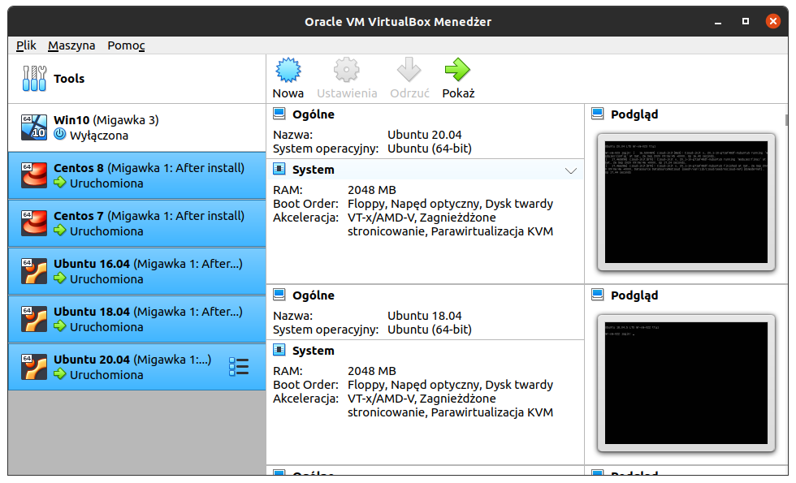
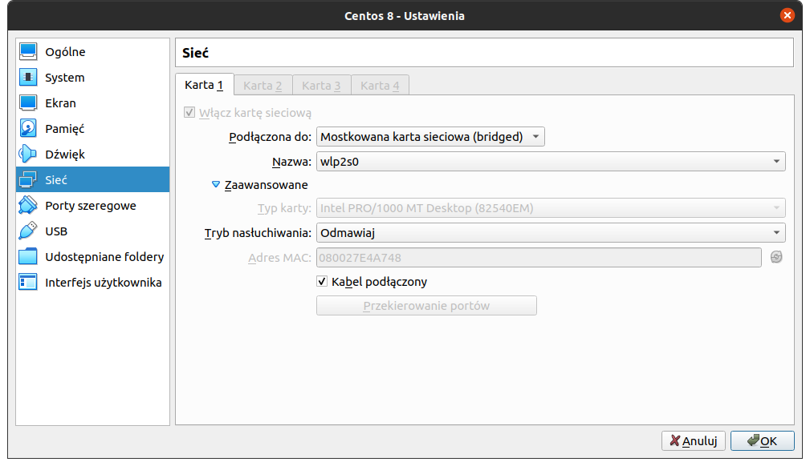

Stworzenie środowiska
=========

Przygotowano 6 maszyn wirtualnych w VirtualBox:
- mr-vm-021.yml # Ubuntu 16.04
- mr-vm-022.yml # Ubuntu 18.04
- mr-vm-023.yml # Ubuntu 20.04
- mr-vm-024.yml # CentOS 7
- mr-vm-025.yml # CentOS 8



Skonfigurowanie wirtualnej maszyny
=========

Ustawienie karty sieciowej w trybie mostka sieciowego, w taki sposób, aby otrzymywał adres IP z Routera.


Ustawienie na serwerze DNS
=========

Za pomocą Ansible, można ustawić adres fqdn na routerze mikrotik w serwerze DNS, jeśli chcesz ręcznie ustaw taką politykę.
Przykład fqdn: `mv-vm-021.rachuna.net`
```
/ip dns static add name=<< fqdn >> address=<< addess_ip >> type=A comment=<< fqdn >>"
/ip dns static add regexp=\".*\\\\.<< fqdn >>\" address=<< addess_ip >> type=A"
```

Jeżeli nie masz routera mikrotik, nic nie szkodzi, możesz ustawić u siebie na swoim hoście taką politykę.
```
$ cat /ect/hosts | c:\Windows\System32\Drivers\etc\hosts

(...)

<< adres_ip >>   << fqdn >> << hostname >>
<< adres_ip >> *.<< fqdn >> << hostname >>
```

Wstępna konfiguracja wirtualnych maszyn
=========
Do komunikacji potrzeby jest klucz SSH, za pomocą którego będziesz się komunikował z maszynami wirtualnymi.
```
$ ssh-keygen
```
Następnie z każdym serwerem musisz wymienić się kluczami.
```
ssh-copy-id << fqdn >>
```
Następnie trzeba przygotować maszyny pod Ansible.

Ubuntu:
```
$ sudo apt-get install -y python python3 && sudo update-alternatives --install /usr/local/bin/python python /usr/bin/python3 10 && python --version
```
CentOS:
```
$ yum install -y python2 python36 && sudo alternatives --install /usr/local/bin/python python /usr/bin/python3 10 && python --version
```

[Powrót](../../README.md)