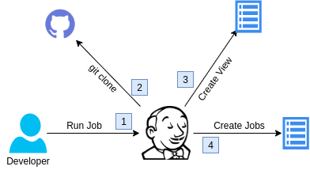

Budowanie kontenera
=========

### Omówienie joba
Po uruchomieniu joba, jenkins pobiera niezbędne repozytoria takie jak:
  - [Repozytorium Jenkins-SeedJobs](git@github.com:wolfsea89/Jenkins-SeedJobs.git)

### Job steps
1. Pobieranie Repoyzotorium Jenkins-SeedJobs
2. Utworzenie joba seedJob
3. Utworzenie widoków
4. Utworzenie jobów

[Powrót](../Overview.PL.md)