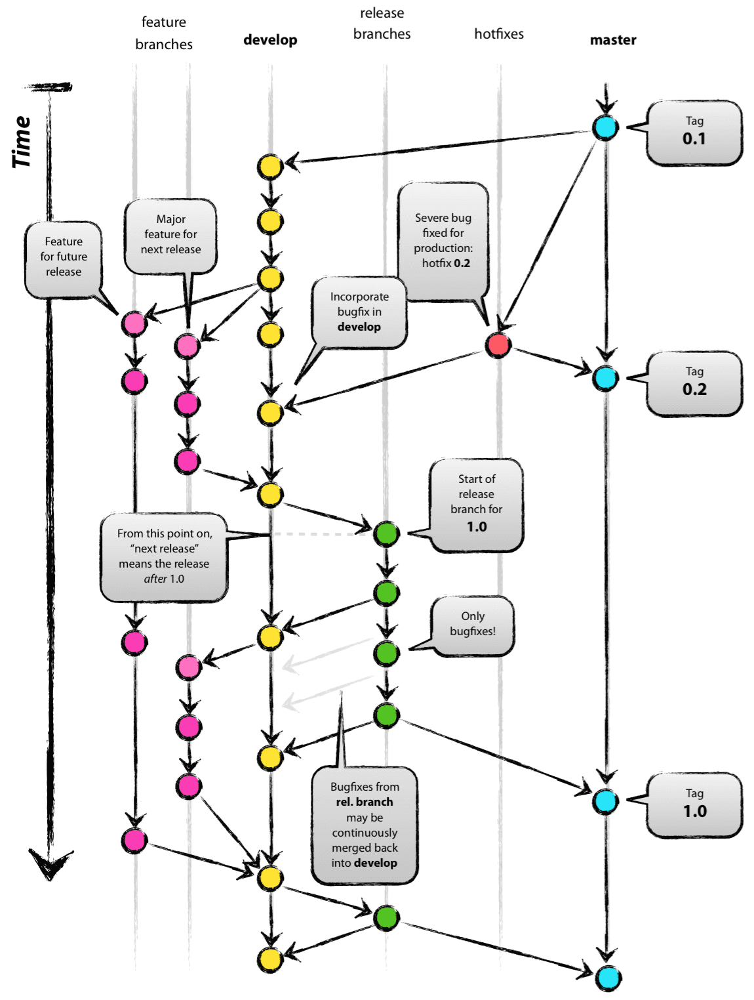

GitFlow
=========
Pracując z Git-em nieodłączne jest tworzenie gałęzi w ramach których rozwijamy nowe funkcjonalności, naprawiamy błędy, przygotowujemy wydania, przeprowadzamy refaktoring i wiele więcej.

- `feature` - branch rozwojowy w ramach Sprintu.
- `epicfeature` (opcjonalny) - branch rozwojowy z Epiką w Scrum/Agile lub w Kanban.
- `develop` - główny branch rozwojowy w pełni funkcjonalnym i działającym kodem. 
- `release` - branch gotowy do publikacji.
- `hotfix` - branch z poprawkami z brancha głównego.
- `master` - branch główny.



GitFlow - rozszerzenie standardu
=========

W moich repozytoriach nastąpiło rozszerzenie standardu

```
feature/*     - branche rozwojowe
epicfeature/* - branche rozwojowe
develop       - główny branch rozwojowy
release/X.Y   - branche release z semantyką kodu
hotfix/X.Y.Z  - branche z hotfixami z semantyką kodu
master        - branch główny
```

Za pomocą tej konwencji mogę w procesie CI wersjonować paczki i wystawiać z release za pomocą nazwy brancha.
W ten sposób, że:
- release/1.3 - proces CI dla brancha release pobierze numer wersji `1.3` i ustawi numer wersji `1.3.0.${BuildNumber}`
- hotfix/1.3.1 - proces CI dla brancha hotfix pobierze numer wersji `1.3.1` i ustawi numer wersji `1.3.1.${BuildNumber}`

[Powrót](../../../README.md)